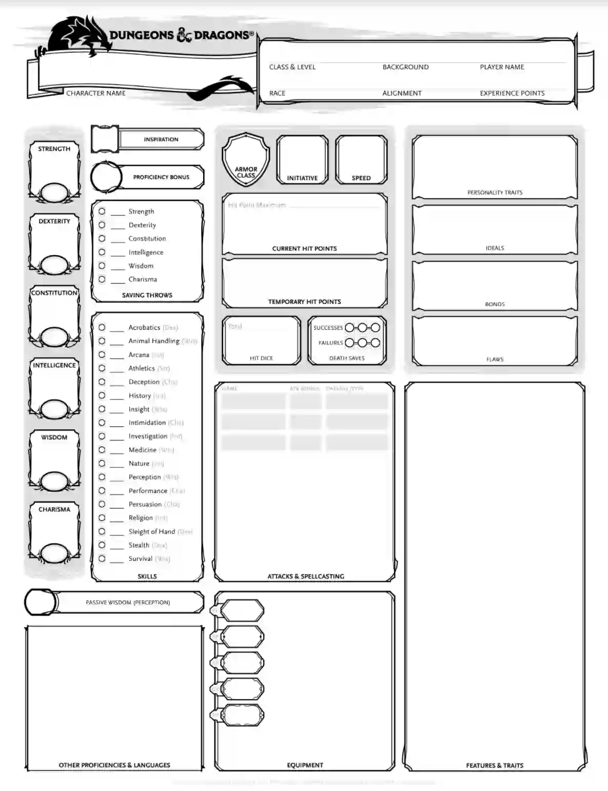
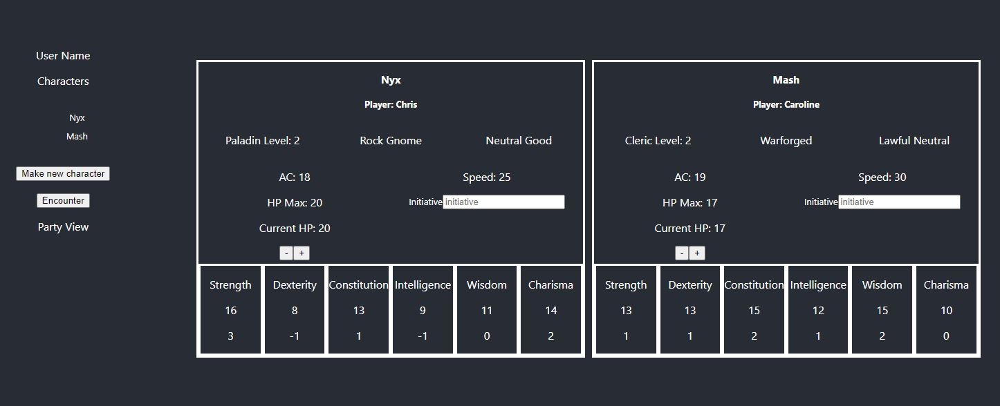

# DnD-dungeon-master-app-client

# Description

## Dungeons & Dragons

Dungeons & Dragons, often shortened to DnD, is a tabletop role playing game in which a group of players is guided through a fantasy adventure by a Dungeon Master, DM (sometimes called Game Master, GM). Each player has a character with different attributes and skills. When a player wishes to perform an action, they will often have to roll a 20 sided die and add relevant modifiers. The DM will compare the player's roll to a score that is related to how difficult the action is to do. The DM is the only person who knows what that score is. The DM will let the player know if they have succeeded or failed their attempt.

The Dungeon Master is has a lot to keep track of, from turn order in combat to spells and enemy stats. This is on top of coming up with interesting narratives and fun sessions for the players!

Dungeons & Dragons can be played in a single session lasting a few hours to months, or years!, long campaign consisting of several sessions.

## This App

As a fan of Dungeons & Dragons and current Dungeon Master, I've decided to develop this app to aid DMs in keeping track of various elements of running a DnD campaign. The original idea was to have this app work solely as a way to keep track of the campaign players' characters, providing all the important information from each character sheet.

Here is the first page of three of a character sheet:

And here is the dashboard view of two characters in the same campaign:

The user is able to make character sheets for their players and keep track of their health points. New features are being added with the current one being an encounter tracker, where the user can add enemies and have the turn order of a combat encounter displayed.

See below for planned and current features.

# Getting Started

### `npm start`

Ensure that the server is running. The server code can be found [here] (https://github.com/ChrisJS90/DnD-dungeon-master-app-server)

Runs the app in the development mode.\
Open [http://localhost:3000](http://localhost:3000) to view it in your browser.

The page will reload when you make changes.\
You may also see any lint errors in the console.

# Features

## Current

View current characters and adjust their health points

## In Progress

Adding new character to the server

Encounter page to add enemies and keep track of health points and turn order

## Planned

View full character sheets for each character

User login

Create multiple campagins/parties

